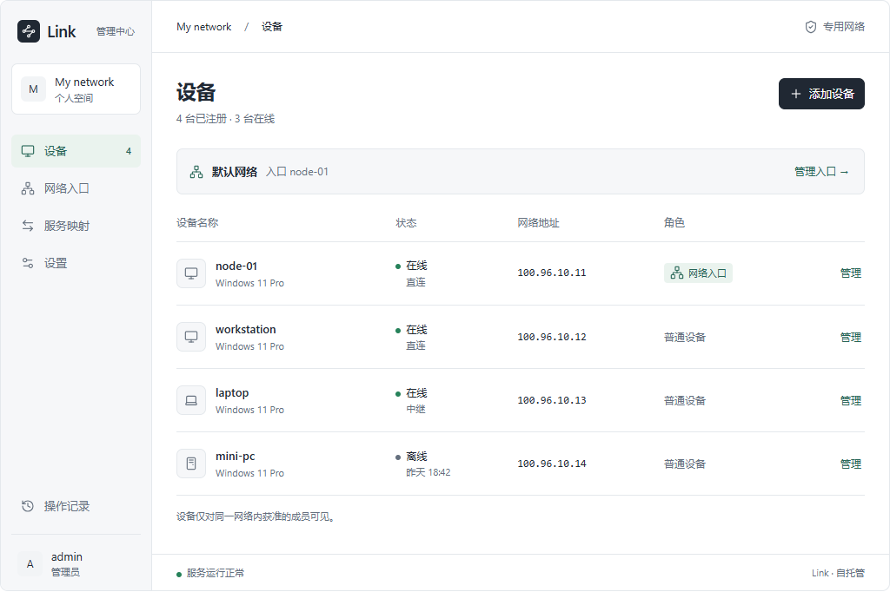
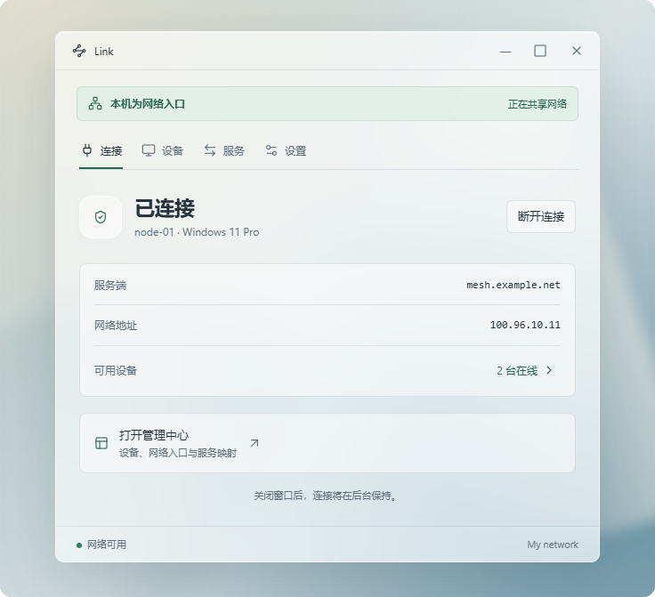
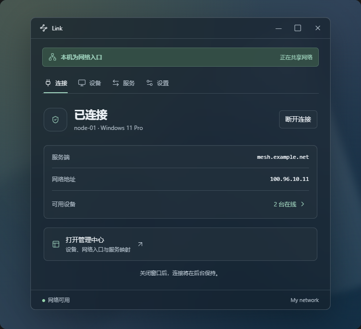

# 界面原型

产品暂名 Link。以下为本次讨论中的界面参考，操作与数据均为模拟，不连接真实设备。

## 管理网页

`admin.fragment.html` 是交互原型源片段，需要支持该片段的预览环境；不是独立的生产网页。

## Windows 客户端

`client.fragment.html` 是交互原型源片段。原生客户端需要独立实现，不能将网页模拟的毛玻璃视为已完成 Windows 桌面适配。

## 已验证范围

原型曾在浏览器中检查设备入口变更、踢下线模拟、服务添加、设置、客户端注册与重连、远程目标展示，以及 320px / 736px 宽度下的横向溢出。

这些检查不证明真实注册、身份验证、系统启动、网络连通、转发或远程桌面调用已实现。
